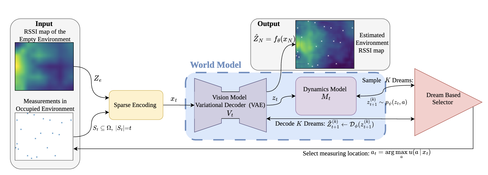
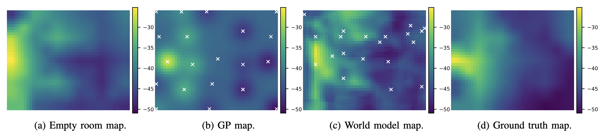

# WorldModelsREM

This repository contains the implementation accompanying the paper *Radio Environment Mapping with World Models for Active Measurement Control: Should Networks Dream of Optimal Control?* The project studies active radio environment mapping (REM) under a limited measurement budget, where the goal is to reconstruct an occupied RSSI map from only a small number of measurements while using an empty-environment map as structural prior information

This repository contains a World Models models solution (Vision VAE + dynamics + dreaming sequence) of measurement selection for a **few-shot RSSI Radio Map reconstruction**. 

## World Model Approach

The approach combines a vision model for RSSI map reconstruction and a dynamics model for dreaming-based active measurement selection. The system evaluates candidate sensing locations by simulating their effect on the latent belief and selects the next measurement expected to improve the final reconstruction most efficiently.



*High-level overview of the proposed world-model-based framework for active radio environment mapping.*

## Installation

```bash
git clone https://github.com/hribarjernej89/WorldModelsREM.git
cd WorldModelsREM
pip install -r requirements.txt
```

## Code 

The `main.py` contains the full experimental pipeline, including dataset loading, model initialization (VAE and dynamics model), loading of pretrained weights, execution of baseline methods (copy-empty and Gaussian Process).The script produces quantitative metrics (e.g., RMSE/MAE) and generates qualitative visualizations such as reconstruction heatmaps and performance curves.

The repository includes a `requirements.txt` file for installing all dependencies, as well as pretrained model weights to facilitate reproducible evaluation without the need for retraining.

## Results

The paper reports that the proposed method outperforms GP-based interpolation in the few-shot regime and can achieve up to a fivefold RMSE reduction with the same number of measurements [file:1]. Figure 3 is a good qualitative result to include in the repository because it shows the world-model reconstruction, GP baseline, and ground truth side by side [file:1].


*Reconstructed RSSI environment maps for a 36 × 44 grid with N = 20 measurements.*


### Citation
Please cite our paper as follows:

```bibtex
@article{hribar2026radio,
  author  = {Hribar, Jernej and  Milosheski, Ljupcho and Shinkuma, Ryoichi},
  title   = {Radio Environment Mapping with World Models for Active Measurement Control: Should Networks Dream of Optimal Control?},
  year    = {2026}
}
```

### Dataset

The RSSI dataset used in this work is available on [Zenodo](https://zenodo.org/records/15791300).

```bibtex
@article{milosheski2025_indoor_radio_mapping_arxiv,
  author  = {Milosheski, Ljupcho and Akiyama, Kuon and Bertalani{\v{c}}, Bla{\v{z}} and Hribar, Jernej and Shinkuma, Ryoichi},
  title   = {An Indoor Radio Mapping Dataset Combining 3D Point Clouds and RSSI},
  journal = {arXiv},
  year    = {2025},
  eprint  = {2511.00494},
  url     = {https://arxiv.org/abs/2511.00494}
}
```

### Acknowledgements

This work was supported in part by the Slovenian Research Agency (ARIS) under grants P2-0016 and MN-0009. and by the Japan Society for the Promotion of Science (JSPS) under grants 23H00464, 25H01124, and 120245002. Additional support was provided by the bilateral project MISA (BI-JP/24-26-001), funded jointly by ARIS and the JSPS.


